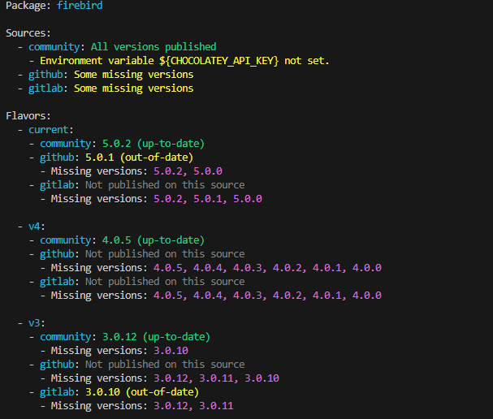

# ChocoForge


PowerShell toolkit for automating the creation, management, and publishing of Chocolatey packages. 

It is designed to simplify the process of keeping Chocolatey repositories up-to-date with the latest releases from upstream projects, supporting advanced templating, flexible configuration, and multi-source publishing.


## Features

- **Declarative YAML Configuration**: Define your package, release sources, flavors, and publishing sources in a single `.forge.yaml` file.
- **GitHub Releases Integration**: Automatically fetches and processes releases and assets from GitHub repositories.
- **Template-Based Packaging**: Uses template substitution to generate nuspec files and scripts from your configuration and release data.
- **Multi-Architecture & Flavors Support**: Maintain packages for multiple architectures or release flavors (e.g. `current`, `beta`) from a single configuration.
- **Multi-source Publishing**: Publish packages to multiple sources, including the official Chocolatey community feed, GitHub NuGet registry, GitLab package registry and any other custom Nuget-compatible repository.
- **SHA256 Handling**: Automatically calculates SHA256 checksums for assets, or uses pre-calculated SHA256 values from GitHub releases (when available).
- **Output Formatting**: Consistent, readable output for status, errors, and results, designed for both human and script consumption.
- **Force-Push Support**: Optionally force-push to GitHub NuGet feeds by deleting existing versions if needed (GitHub only).


## Example output




## Requirements
- PowerShell 7.5 or later
- Chocolatey CLI (`choco.exe`) installed and available in your PATH


## Getting Started

1. **Prepare Your Configuration**
   - Create a `.forge.yaml` file.
   - Define your package name, GitHub release source, flavors, and publishing sources.

2. **Review Status**
   - Get a summary of your configuration and publishing status:
     ```powershell
     Get-ForgeConfiguration
     ```

3. **Build and Publish Packages**

   - Or sync everything in one go:
     ```powershell
     Sync-ForgePackage -Verbose
     ```


## Configuration

A typical `.forge.yaml` file includes:
- `package`: The package name.
- `releases.source`: The GitHub repository URL to fetch releases from.
- `releases.flavors`: Define one or more flavors (e.g., current, beta) for different release patterns.
- `sources`: One or more publishing Chocolatey (NuGet) sources, each with a URL and API key (can use environment variables).

See [this](https://github.com/fdcastel/chocolatey-packages) repository for real-world examples.


## Tips
- Review the output of `Get-ForgeConfiguration` before publishing.
- Use `-WhatIf` and `-Verbose` for safe, transparent operations.
- Pass API keys via environment variables. Do not store them directly in the `.forge.yaml`.
- Explore the [`Tests/`](Tests) folder and the [reference repository](https://github.com/fdcastel/chocolatey-packages) for more usage patterns.
- For more details see the inline help in each function. 
